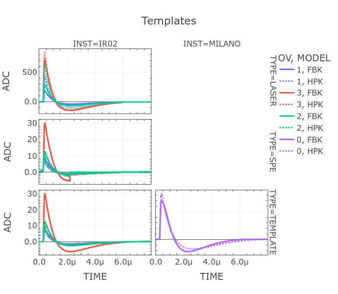

# TEMPLATE_COMPARISON

Notbook and library with plotly integartion to compare wvfs of differnet types.

## Installation

```bash
pip install -r requirements.txt
```

## Usage

```bash
juptyer notebook template_comparison.ipynb
```

## Output example



## TODO

* Add more types of wvfs:
  * ~~Include all SPE templates~~.
* Add more types of comparison:
  * Add comparison of wvfs with different norm.
  * Add comparison of wvfs with different scale.
* Add more types of data:
  * Add data from binary files.
* Add more types of analysis:
  * Add analysis of wvfs' AMP, RMS, etc.

## License

[MIT](https://choosealicense.com/licenses/mit/)

## Authors (alphabetical order, please insert your name here if you contribute to this project)

* [**Manthey Corchado, Sergio**](https://github.com/mantheys)

## Acknowledgments